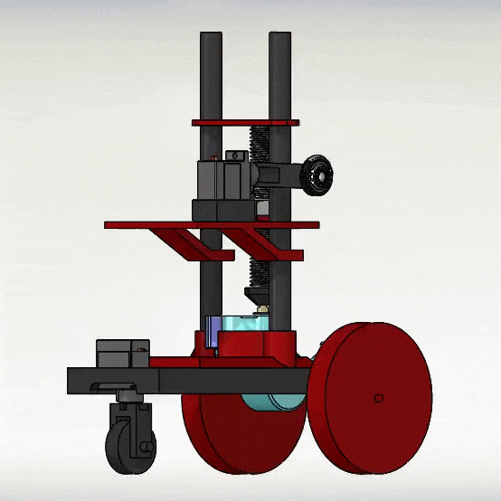

# autoPhotogrammetry
Automating Mid-size Photogrammetry; nwHacks2020
In collaboration with: Jonathan Luna, Manu Mahadevan Koipallil

## Inspiration
Current setups for mid-sized Photogrammetry are costing in excess of $30000 CAD, and has multiple functionality issues. In a similar option, PI3DSCAN, the rig can not scan outdoor, produces lower quality photos, and require costly technician labor for assembly and operation. In another option, FoxyWalk, the rig can not go into potentially dangerous areas, produces unsteady photos, and also require costly technician labor. With automation, the process can be simplified, and new markets can be explored, such as deep-forest botanical specimen scanning, or archaeological site preservation.

## What it does
The proof-of-concept vehicle, with a mounted camera, circles an object at an adequate radius, taking photos at regular intervals/angles, at various different camera heights, creating a high quality set of photos suitable for photogrammetry, all automated.

## How I built it
CAD and render using SolidWorks and McMaster-Carr, and electrical design and firmware using Arduino C. Previously-planned user app using WPF App (.NET Framework).

## Challenges I ran into
Hardware failure, missing directives in .NET Framework, manufacturing failures, networking issues, confusion with physical modelling, unclear documentation.

## Accomplishments that I'm proud of
Hardware-software integration, creating a very feasible low-cost solution with the potential to disrupt a growing, emerging, high-value market.

## What I learned
Autonomous vehicle control, more about photogrammetry, electronic circuit design, more about programming in C and Arduino.

## What's next for autoGrammetry
Feedback loop using additional sensors, automatic path tracking and exporting, scaling up the prototype for larger scans, implementing bluetooth and cloud save functionality, full integration with photogrammetry software, gyroscope for enhanced uneven terrain stability, mobile app integration, GPS and self deployment, and 4G/5G/LTE device connectivity.
